# 🚀 Techfest Demo Website

A stunning, fully responsive landing page built for **Techfest IIT Bombay** Creativity Task.  
Crafted with **React**, **Tailwind CSS**, and **Lucide Icons**, this modern UI reflects the innovation, mission, and sponsorship vision of Techfest.

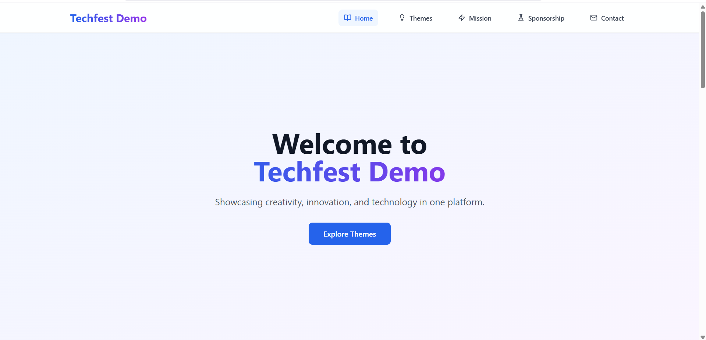

---

## 🧭 Navigation Bar

The navigation bar is:

- 🧷 **Sticky** on top  
- 💡 Supports **smooth scrolling**  
- 🎯 Highlights the **active section** on scroll  
- 📱 Fully **mobile responsive** with a toggleable sidebar menu  

**🖥 Navigation Bar**  
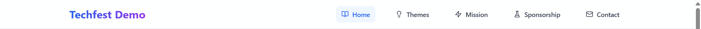

**📱 Mobile View**  
<div align="center">
  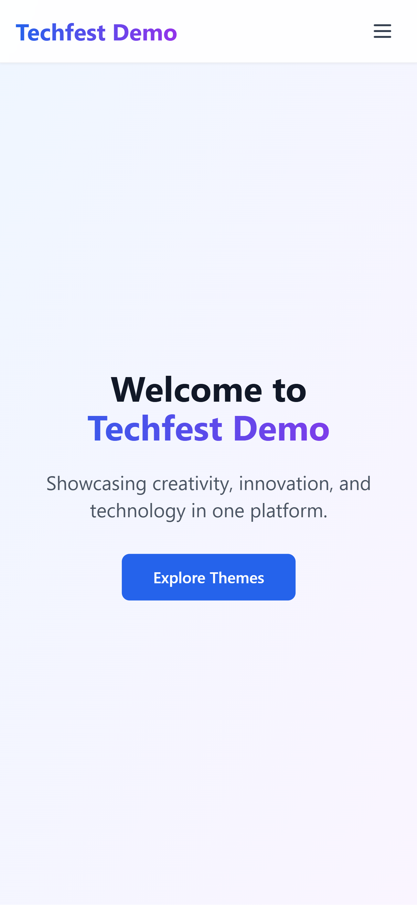
  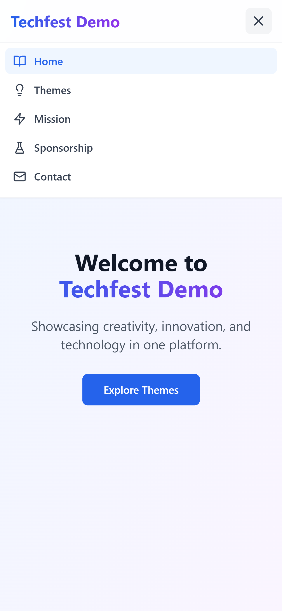
</div>

---

## 📸 Full Page Screenshots

| Section     | Desktop View                                   | Mobile View                                   |
|-------------|------------------------------------------------|-----------------------------------------------|
| Hero        |         |         |
| Themes      | 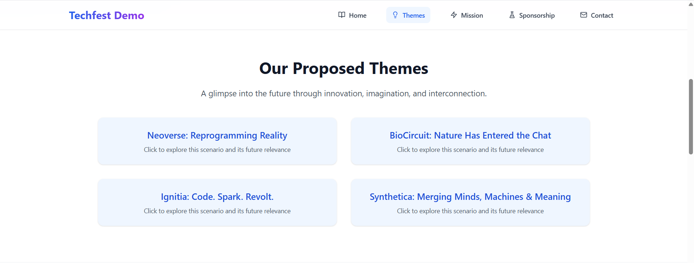    | 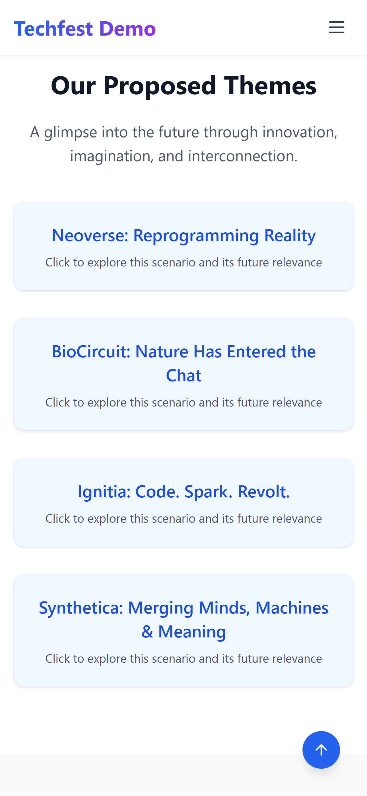    |
| Mission     | 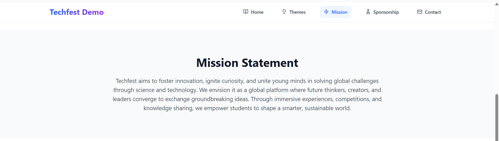  | 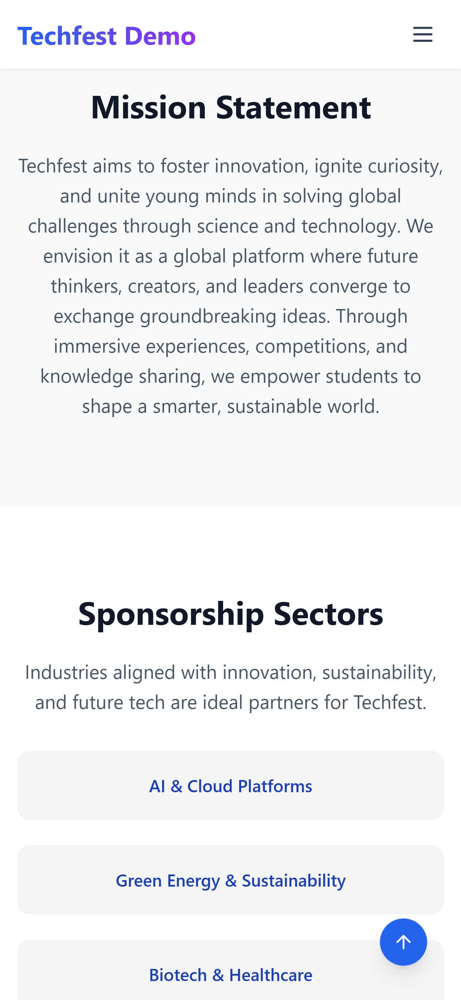  |
| Sponsors    | 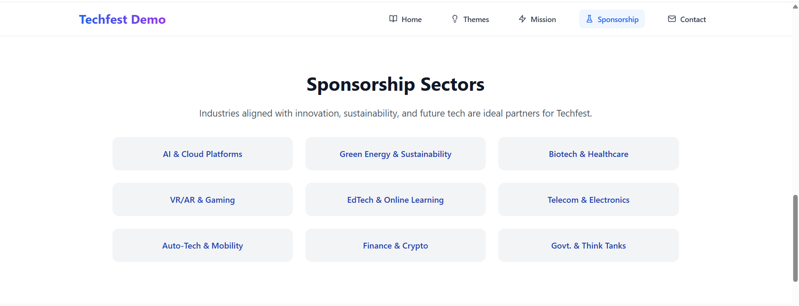| 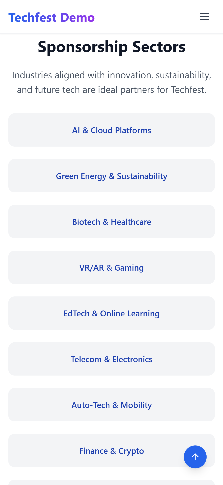|
| Contact     | 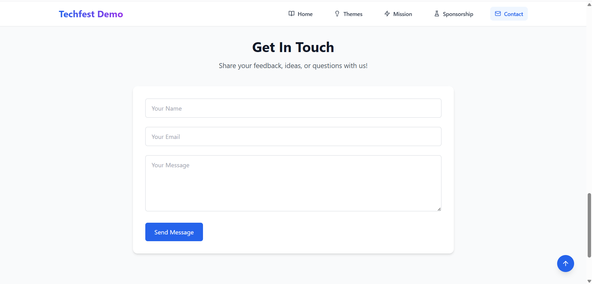  | 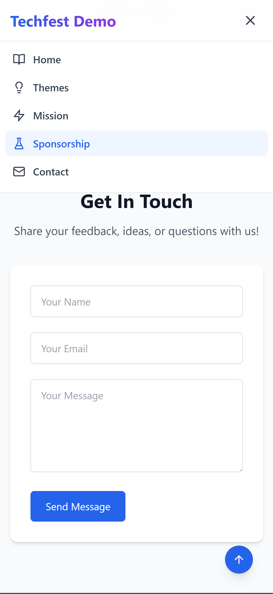  |
| Footer      | 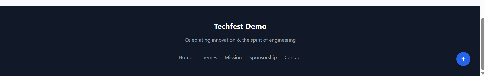    | 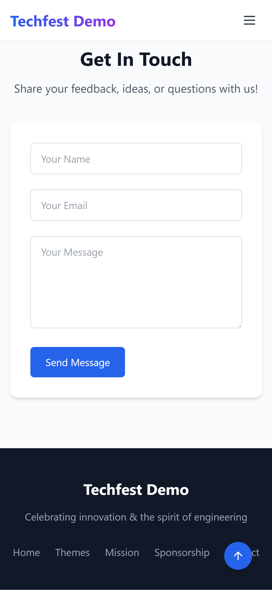    |


---

## ✨ Features

- 🔝 Sticky & responsive navigation bar with scroll behavior  
- 🪄 Smooth section-based navigation  
- ⚡ Eye-catching CTA with gradient animation  
- 📱 Optimized for mobile and desktop  
- 🔼 Scroll-to-top floating button  
- 🎯 Clean, elegant, and modular UI  
- 🔧 Easy to customize and deploy  

---

## 🛠 Tech Stack

- ⚛️ React.js (Vite)  
- 💨 Tailwind CSS  
- 🎨 Lucide Icons  


---

## 📥 Getting Started

```bash
git clone https://github.com/omkar-103/techfest-creative-showcase.git
cd techfest-creative-showcase
npm install
npm run dev
```

---

## 🌐 Live Demo

> 🔗 **Live link!**  
>  Deployed on:
- [Vercel](https://vercel.com/)

---

## 🤝 Contributing

Found a bug or have suggestions?  
You're welcome to open an issue or submit a PR!

---


## 🙌 Credits

Built with 💙 by **[Omkar](https://www.linkedin.com/in/omkar-parelkar/)**  
Made for the **Web Development Domain Task – Techfest IIT Bombay**  
This task focused on building a responsive single-page website that reflects Techfest's identity and outreach goals, featuring smooth scrolling, mobile responsiveness, and intuitive navigation.
