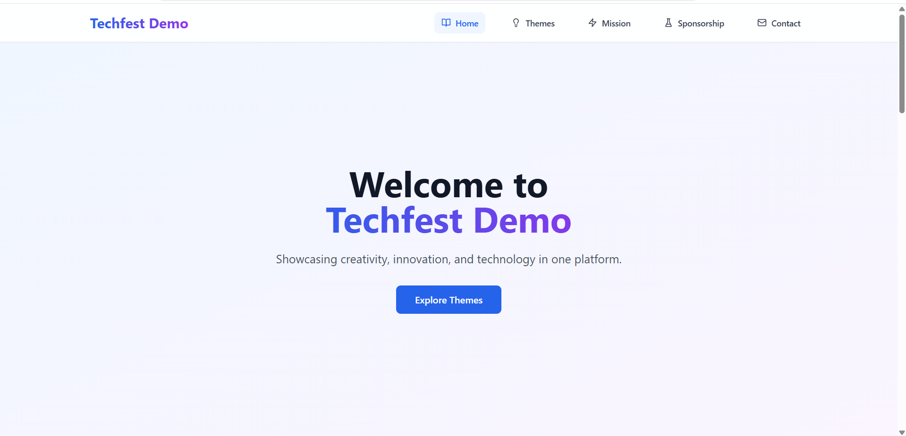
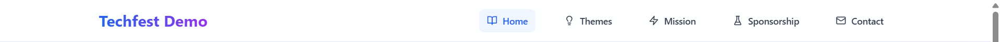
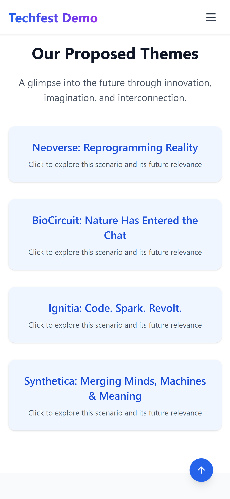
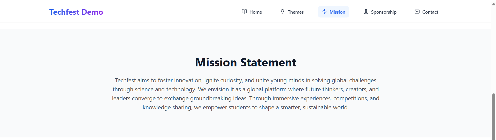
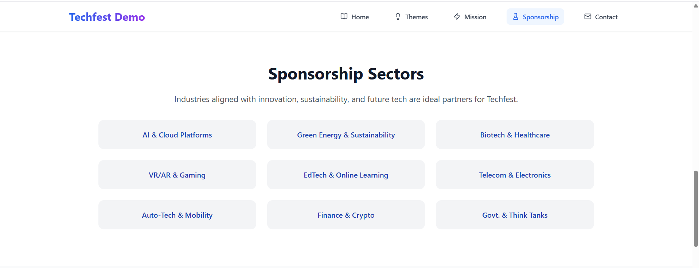
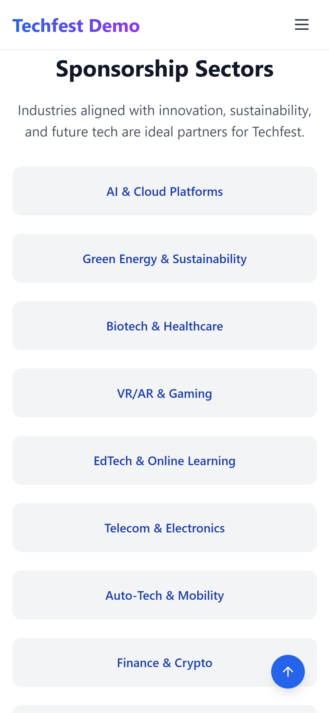
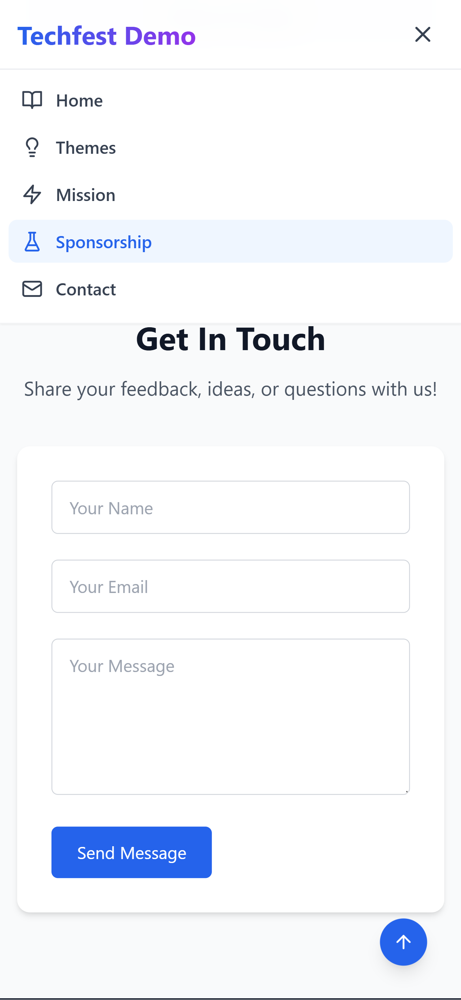
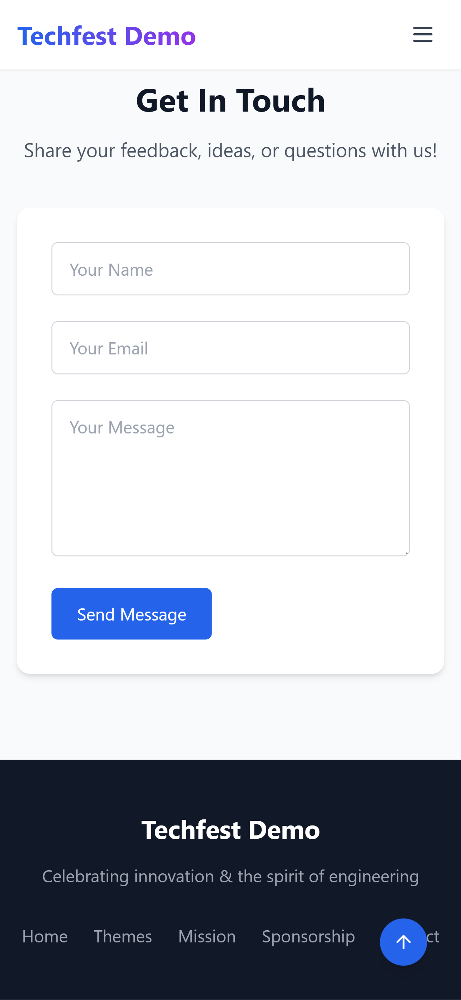

# 🚀 Techfest Demo Website

A stunning, fully responsive landing page built for **Techfest IIT Bombay** Creativity Task.  
Crafted with **React**, **Tailwind CSS**, and **Lucide Icons**, this modern UI reflects the innovation, mission, and sponsorship vision of Techfest.



---

## 🧭 Navigation Bar

The navigation bar is:

- 🧷 **Sticky** on top  
- 💡 Supports **smooth scrolling**  
- 🎯 Highlights the **active section** on scroll  
- 📱 Fully **mobile responsive** with a toggleable sidebar menu  

**🖥 Desktop View**  


**📱 Mobile View**  
<div align="center">
  
  
</div>

---

## 📸 Full Page Screenshots

| Section     | Desktop View                                   | Mobile View                                   |
|-------------|------------------------------------------------|-----------------------------------------------|
| Hero        |         |         |
| Themes      |     |     |
| Mission     |   |   |
| Sponsors    | | |
| Contact     |   |   |
| Footer      |     |     |

📂 All screenshots are stored in the `/screenshots` directory.

---

## ✨ Features

- 🔝 Sticky & responsive navigation bar with scroll behavior  
- 🪄 Smooth section-based navigation  
- ⚡ Eye-catching CTA with gradient animation  
- 📱 Optimized for mobile and desktop  
- 🔼 Scroll-to-top floating button  
- 🎯 Clean, elegant, and modular UI  
- 🔧 Easy to customize and deploy  

---

## 🛠 Tech Stack

- ⚛️ React.js (Vite)  
- 💨 Tailwind CSS  
- 🎨 Lucide Icons  

---

## 📂 Folder Structure

```
techfest-demo/
├── public/
│   └── index.html, favicon, etc.
├── src/
│   ├── App.jsx
│   ├── main.jsx
│   └── index.css
├── screenshots/
│   └── [all UI screenshots]
├── tailwind.config.js
├── package.json
└── README.md
```

---

## 📥 Getting Started

```bash
git clone https://github.com/your-username/techfest-demo.git
cd techfest-demo
npm install
npm run dev
```

---

## 🌐 Live Demo

> 🔗 **Live link coming soon!**  
> Easily deploy using:
- [Vercel](https://vercel.com/)
- [Netlify](https://netlify.com/)
- [GitHub Pages](https://pages.github.com/)

---

## 🤝 Contributing

Found a bug or have suggestions?  
You're welcome to open an issue or submit a PR!

---

## 📄 License

This project is licensed under the **MIT License**.  
You are free to reuse, share, and build upon it — just give proper credit.

---

## 🙌 Credits

Built with 💙 by **[Your Name]**  
Made for the **Creativity Domain Task – Techfest IIT Bombay**  
Design + Code showcase for frontend and UI/UX skills.

---